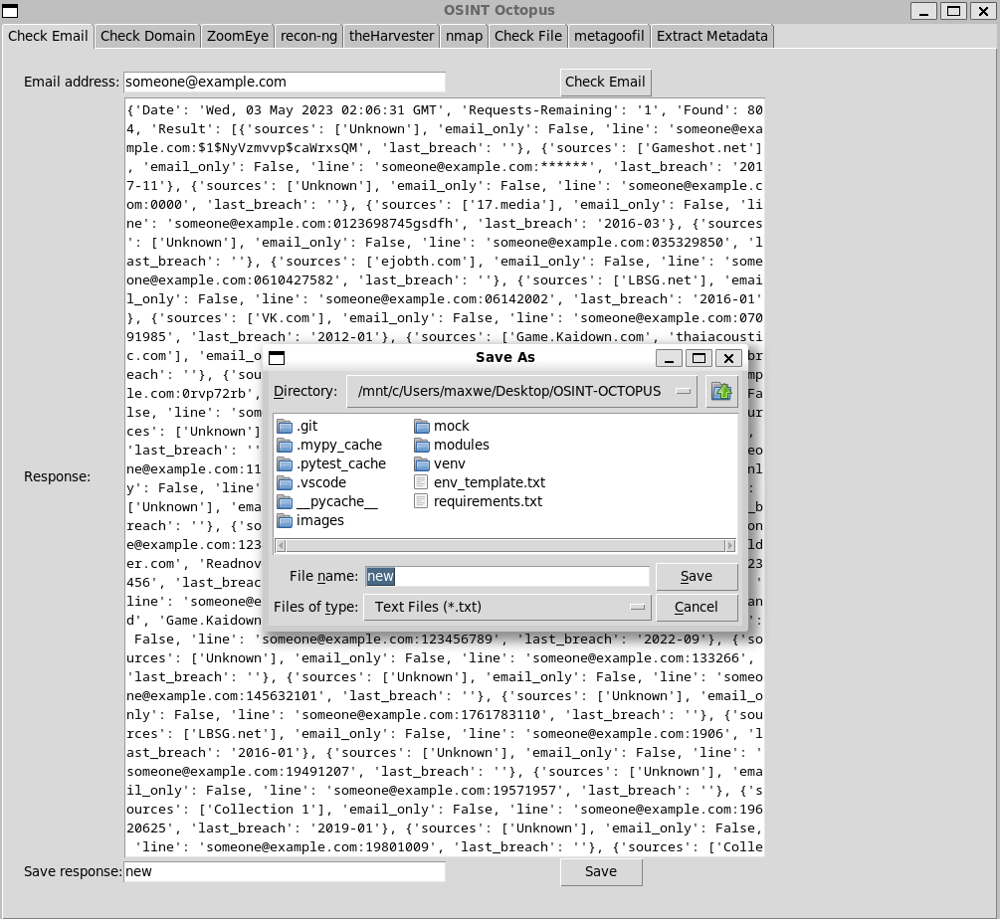
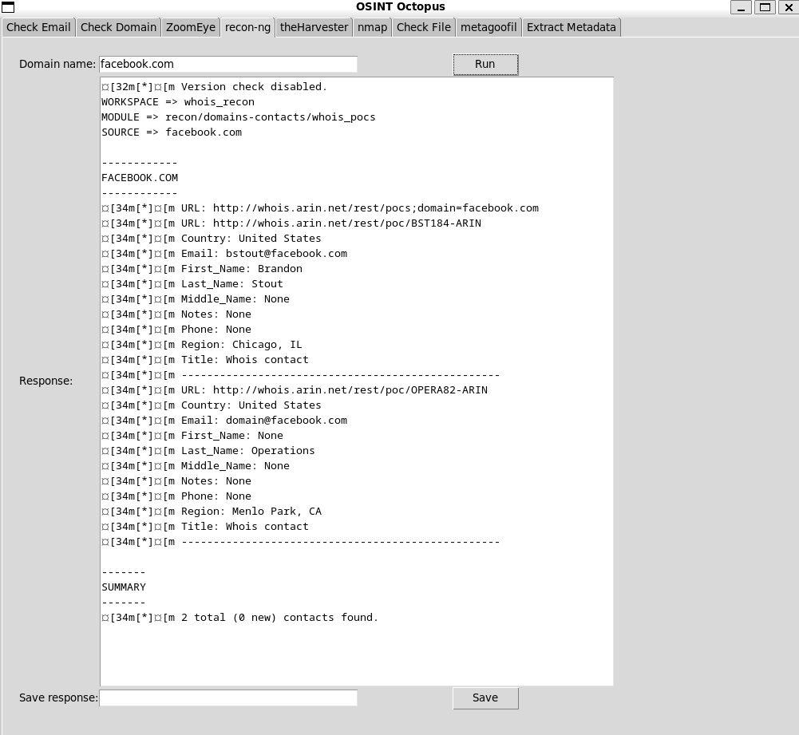
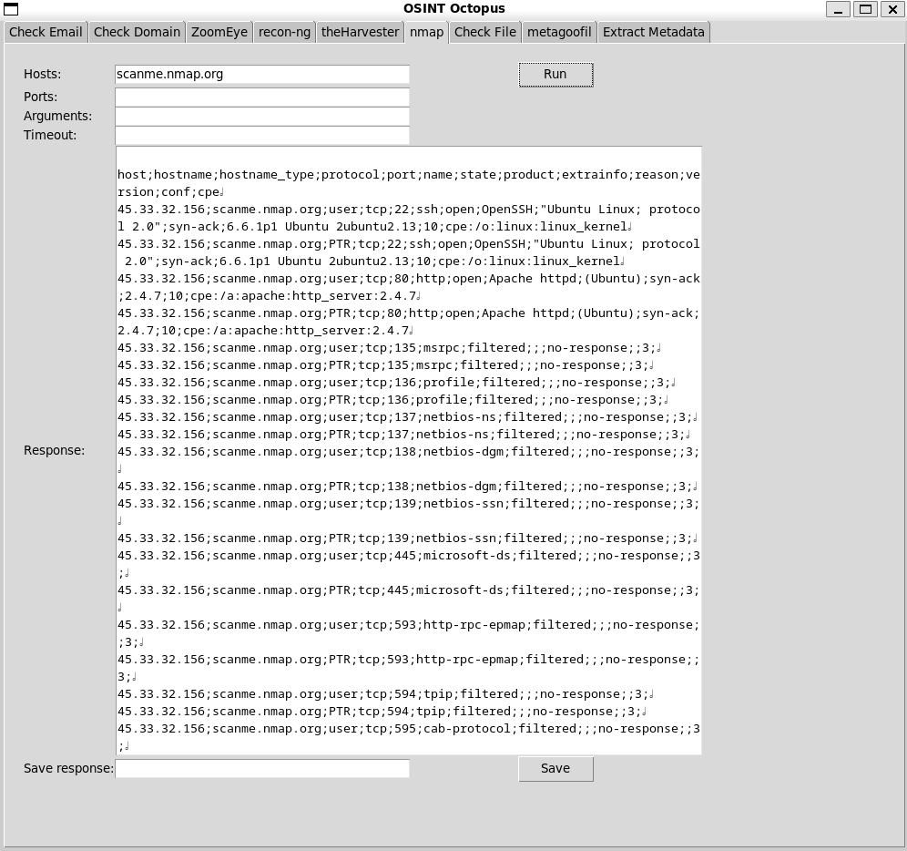

# OSINT-OCTOPUS

OSINT-octopus is a collection of different OSINT tools brought together in a python GUI application. Feature include:
 - checking if an email was in a data breach with breachdirectory
 - use builtWith to determine what technologies a website uses 
 - use zoomEye to see vulnerable, open devices connected to the internet
 - harvest POC data from whois queries for a given domain using recon-ng's whois_pocs module
 - find emails and subdomains for a given domain using theHarvester
 - run an Nmap scan to discover ports, services, os's
 - run metagoofil to find and download documents belonging to a target
 - use PyExifTool to extract metadata from files
 - check files for malware using VirusTotal

## SETUP & INSTALLATION

This software was tested on Kali GNU/Linux version 2023.1

1. Ensure that the following are installed:
    - [python v3.11.2](https://linuxnightly.com/install-python-kali-linux/)
    - pip v23.0.1
    - [recon-cli v5.1.2](https://www.kali.org/tools/recon-ng/)
      - [recon/domains-contacts/whois_pocs module](https://www.101labs.net/comptia-security/lab-3-recon-ng/)
    - [theHarvester v4.2.0](https://www.kali.org/tools/theharvester/)
    -[metagoofil v1.2.0](https://www.kali.org/tools/metagoofil/)
2. Place API keys in `.env` file in the root of the project (you can rename 'env_template.txt)
    - [breachdirectry](https://rapidapi.com/rohan-patra/api/breachdirectory) : XRAPID_API_KEY
    - [BuiltWith](https://api.builtwith.com/free-api) : BUILTWITH_API_KEY
    - [ZoomEye](https://www.zoomeye.org/doc) : ZOOMEYE_API_KEY
    - [VirusTotal](https://developers.virustotal.com/reference/overview) : VIRUSTOTAL_API_KEY
3. Run command `pip install -r requirements.txt`
4. To start the app run `python osint_octopus.py`

To run tests run `python run_tests.py`

## USAGE

#### Check Email

To check is an email has been in a breach input an email address and click `Check Email`. The Response windows are scrollable.

#### Save Response

To save a response input a file name into the 'Save response' box and click `Save` and select where to save it.

#### Check Domain

To determine what technologies are used input a domain name and click `Check Domain`

#### ZoomEye

To use ZoomEye select a type and input a value corresponding to a type. [More info](https://www.zoomeye.org/doc)

#### Recon-ng

To use the recon-ng whois_poc module input a domain name.

#### theHarvester

To use theHarvester input a domain, select a source and input a limit on the number of results.

#### Nmap

To run an Nmap scan input a host or ip address.
The default values for the other fields are:

- Ports : '1-1000'
- Arguments : '-A'
- Timeout : 0

#### Check File

To check is a file is malicious input it's path, relative paths are based the projects root.

#### Metagoofil

To use Metagoofil input a domain and a file type.
The defaults for the other fields are:

- Delay : 30
- Search max : 100
- Download file limit : 100
- Save directory : '.'
- Number of threads : 8
- URL timeout : 15
- User agent : None
- Save file name : None
- Download : False

#### Extract Metadata

To extract metadata from a file input the file path or a comma separated list of files.

# Documentation

### Tools and APIS used

- https://breachdirectory.org/
- https://pro.builtwith.com/
- https://www.zoomeye.org/
- https://github.com/lanmaster53/recon-ng
- https://github.com/laramies/theHarvester
- https://nmap.org/
- https://github.com/opsdisk/metagoofil
- https://pypi.org/project/PyExifTool/
- https://www.virustotal.com/gui/home/upload

## System Overview

#### osint_octopus.py

This is the entrypoint to the app and the code for the tkinter GUI is also located in this file. 

Each function corresponds to a number to interact with tkinter widgets:

1. checkEmail
2. builtWith
3. zoomEye
4. recon_ng
5. theHarvester
6. run_nmap
7. checkFile
8. metagoofil
9. extractMetadata

#### run_tests.py

*Note: I couldn't get pytest to run because of some of the imported libraries interfered with it*

Calls the tests module.

### Modules

#### tests.py

Checks to make sure the extract_info functions work, make sure that invalid file paths are not sent to VirusTotal. The extractMetadata function is tested. Access to the recon-cli and metagoofil is tested.

#### breachdirectory.py

#### builtwith.py

#### exiftool.py

#### metagoofil.py

#### nmap.py

#### recon_ng.py

#### theHarvester.py

#### virustotal.py

#### zoomeye.py